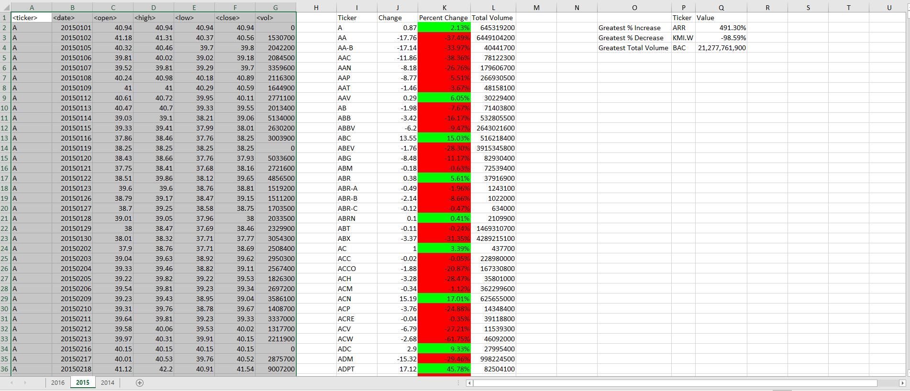

# UCF Data Analysis And Visualization Bootcamp Homework #2 - January 9, 2021

# VBA Homework - The VBA of Wall Street

## Background

In this homework, we use VBA scripting to analyze real stock market data. and complete some challenge tasks.

### Files

This link shows the [VBA script](Resources/wall_street.vbs) for this homework.

### Stock market analysis results

The VBA program analyzes the stock data for several stock tickers from 2014 to 2015 and produces the following summary information:
  * The Stock ticker symbol.
  * The change in price during the year. 
  * Its percent increase or decrease during the year.
  * The total volume of shares during the year.
  
  The bonus section finds the stock with the largest percent increase and percent decrease in price, as well as the largest volume, for each year. 
  
## Year 2016

## Year 2015

## Year 2014

## 

This link shows a [short video](https://drive.google.com/file/d/1B6gPF9t21IeUJ7GJTR_tQrZrofULJ2LV/view) of the program execution. 

